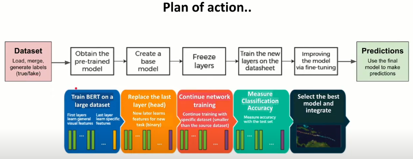
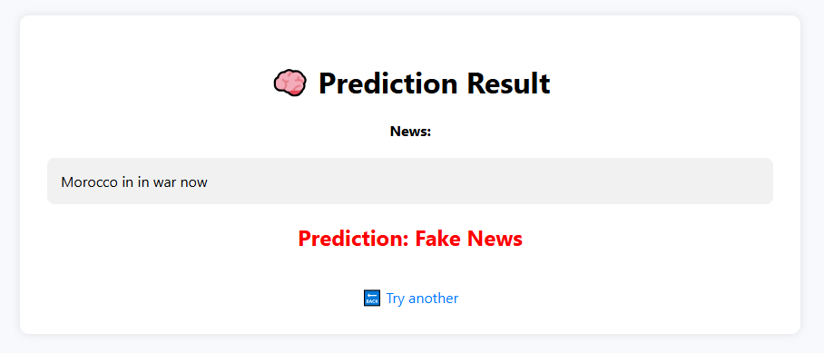

#  Fake News Detection using Fine-tuned BERT

This project demonstrates how to fine-tune a pre-trained BERT model to detect fake news articles using a labeled dataset. It includes data preprocessing, model training, evaluation, and deployment via a Flask web app.

---

## 📁 Project Structure

```

├── Finetuning-BERT-Fake-News-Detection.ipynb   # Main notebook for training the model
├── Testing\_BERT.ipynb                          # Notebook for testing and evaluation
├── app.py                                      # Flask web application
├── a1\_True.csv                                 # Dataset of real news articles
├── a2\_Fake.csv                                 # Dataset of fake news articles
├── model/
│   └── fakenews\_weights.pt                     # Another saved model version
├── static/
│   └── style.css                               # Styling for the web interface
├── templates/
│   ├── index.html                              # Home page for news submission
│   └── result.html                             # Result page for prediction
├── logs.log                                    # Log file during training or testing
└── README.md                                   # This file

````

---

## 🧪 Dataset

The dataset consists of two CSV files:

- `a1_True.csv` – real news articles
- `a2_Fake.csv` – fake news articles

Each file includes the text of the news and associated metadata. The data is preprocessed and combined for training.

---

## 🧠 Model

- **Model Used:** [`bert-base-uncased`](https://huggingface.co/bert-base-uncased)
- **Architecture:**
  - Pre-trained BERT encoder
  - Linear → ReLU → Dropout → Linear → LogSoftmax
- **Loss Function:** Negative Log Likelihood Loss (`NLLLoss`)
- **Optimizer:** `AdamW` with a learning rate of `1e-5`
- **Output Classes:** `Real` or `Fake`


-> Fine-tuning BERT model process :



---

### 📈 Evaluation

After fine-tuning the BERT model on the fake news dataset, the classifier achieved the following performance metrics on the test set:

```
              precision    recall  f1-score   support

       Real       0.84      0.92      0.88      3213
       Fake       0.92      0.84      0.88      3522

    Accuracy                           0.88      6735
   Macro avg       0.88      0.88      0.88      6735
Weighted avg       0.88      0.88      0.88      6735
```

✅ **Overall Accuracy:** 88%
📊 **Balanced Performance:** Both real and fake news are classified with high precision and recall, indicating that the model is not biased toward either class.

---

## 🚀 How to Use

### 🔧 1. Install Requirements

```bash
pip install torch transformers flask
````

### 🏋️ 2. Train or Load the Model

* Use the notebook `Finetuning-BERT-Fake-News-Detection.ipynb` to train and save the model.
* Or use the already fine-tuned model in `cashe/c2_new_model_weights.pt`.

### 🌐 3. Run the Flask Web App

```bash
python app.py
```

Then open your browser and visit: [http://localhost:5000](http://localhost:5000)

---

## 🖥️ Web Interface

* Paste a news article into the form.
* Click "Check".
* The app will return a prediction: ✅ **Real News** or ❌ **Fake News**





---

## 🧪 API Endpoint

You can also use the API with a POST request:

```bash
curl -X POST http://localhost:5000/api/predict \
     -H "Content-Type: application/json" \
     -d '{"text": "Some news content here..."}'
```

Response:

```json
{
  "prediction": "Fake News"
}
```

---

## 🙌 Acknowledgements

* [BERT: Pre-training of Deep Bidirectional Transformers for Language Understanding](https://arxiv.org/abs/1810.04805)
* Hugging Face Transformers
* PyTorch
